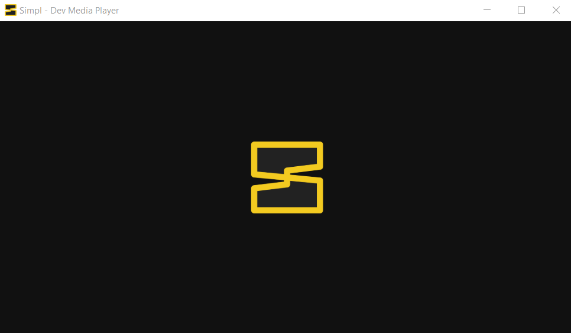
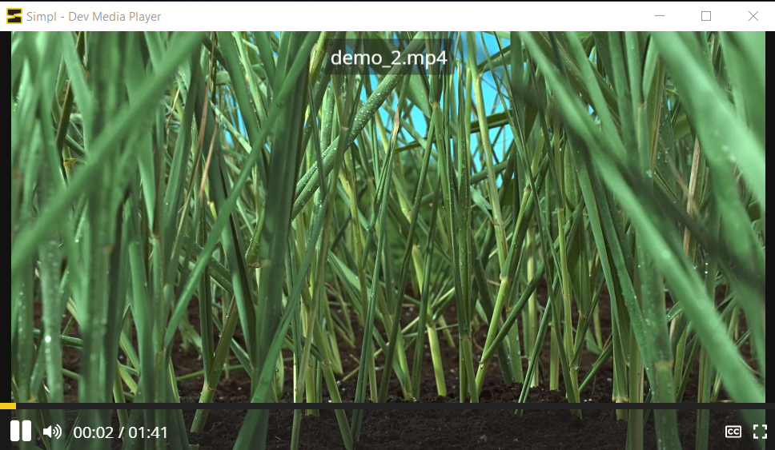
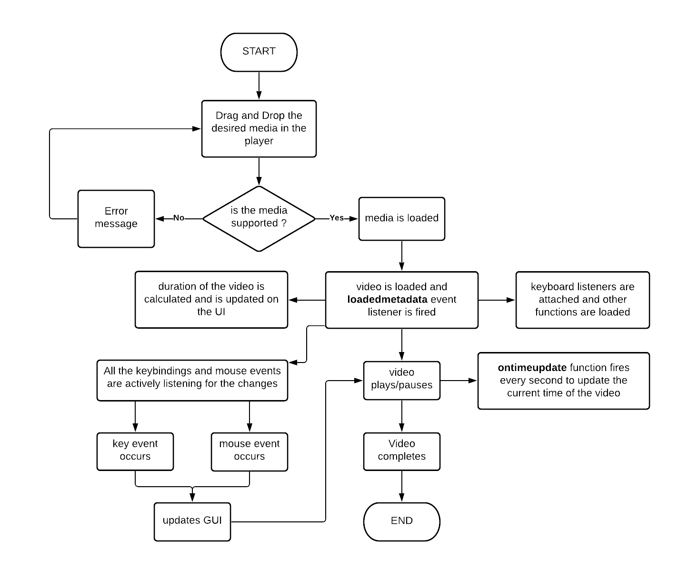

<link rel="stylesheet" href="https://cdnjs.cloudflare.com/ajax/libs/font-awesome/5.15.4/css/all.min.css" integrity="sha512-1ycn6IcaQQ40/MKBW2W4Rhis/DbILU74C1vSrLJxCq57o941Ym01SwNsOMqvEBFlcgUa6xLiPY/NS5R+E6ztJQ==" crossorigin="anonymous" referrerpolicy="no-referrer" />

[](https://svgshare.com/i/Zhy.svg)
[](https://svgshare.com/i/ZhY.svg)
[](https://svgshare.com/i/ZjP.svg)
[](https://www.electron.org/)
[](https://opensource.org/licenses/MIT)

<br/>

<p align="center">
  <a href="https://github.com/daxter-army/simpl/">
    
  </a>

  <h3 align="center">Simpl - video player for devs</h3>

  <p align="center">
    A video player, specially for devs
    <br />
    <a href="https://daxter-army.github.io/simpl/"><strong>Project Homepage »</strong></a>
    <br />
    <br />
  </p>
</p>

<details open="open">
  <summary>Table of Contents</summary>
  <ol>
    <li>
      <a href="#about-the-project">Introduction</a>
      <ul>
        <li><a href="#novelty-of-the-idea">Novelty</a></li>
        <li><a href="#built-with">Flow chart of Methodology</a></li>
        <li><a href="#functionalities">Functionalities</a></li>
        <li><a href="#built-with">Built With</a></li>
      </ul>
    </li>
    <li>
      <a href="#getting-started">Getting Started</a>
      <ul>
        <li><a href="#getting-started">Getting Started (Development)</a></li>
        <li><a href="#prerequisites">Prerequisites</a></li>
        <li><a href="#installation">Installation</a></li>
        <li><a href="#building">Building</a></li>
      </ul>
    </li>
    <li><a href="#usage">Usage</a></li>
    <!-- <li><a href="#roadmap">Roadmap</a></li> -->
    <!-- <li><a href="#contributing">Contributing</a></li> -->
    <li><a href="#license">License</a></li>
    <li><a href="#contact">Contact</a></li>
    <li><a href="#acknowledgement">Acknowledgement</a></li>
    <li><a href="#info">Info</a></li>
    <!-- <li><a href="#issues">Issues</a></li> -->
  </ol>
</details>

<!-- ABOUT THE PROJECT -->

## ✨ Introduction

<p align="center">


</p>

In this internet age, everyone is learning to stay ahead in their career or to develop something new, creative and fun. Digging the internet for quality tutorials, watching that youtube videos of blender, illustrator, photoshop, webdev and coding along. Coding along with videos is a nightmare specially if you are only having one single display.
Simpl allows you to watch your favourite tutorial, with minimalistic interface and functionalities, so that the video player controls do not occupy the space, only showing video on the screen.
<br/><br/>

## 🌠 Novelty of the Idea
There are plenty of video players, in the market, but they come with bulky interfaces, features that we don't use while we are learning or watching any tutorial. Simpl is a simple video player comes with only needed features yet is richful, that do not occupies much space of the interface. Only view your video.

## 💿 Flow Chart of Methodology


## 🌟 Functionalities
* Following are the functionalities implemented till now:

* **Play anything (*subtitles included)**
  * Just drag and drop your video to play
  * Just drag and drop your subtitle file to play it along the video

* **Cross platform application**
  * One code, All platforms

* **Minimalistic design**
  * only see the usefull stuff on the screen, not the typical useless and bulky UIs

* **Keyboard support**
  * control the whole video right from your keyboard

* **More features coming soon...**

### 🛠 Built With

This is achieved with **ElectronJS**, and the whole application is written in html, css and vanilla javascript, and the application is build with **electron-builder**, for cross-platform compatibilty.

- [electron](https://electronjs.org)
- [electron-builder](https://electron.build)

<!-- GETTING STARTED -->

## 🚲 Getting Started

- Just go to the [Homepage](https://daxter-army.github.io/simpl), and download the package as per your OS.

- After opening the application, just drag and drop the video on the application, you want to see.

- Only available for windows till now, support for macOS and linux is coming soon.

<!-- **For Linux/OS X users only**

- After downloading the file, open the properties of the file, go to permissions tab and check the option saying **allow executing file as program**, and then run the file, now it would run smoothly. -->

## 🚵‍♂️ Getting Started (Development)

This section will help you to get started with the project, locally.

## ⭐ Prerequistes

- You should be having nodeJS version > 12.x
- After this install electron globally with
```sh
  npm i electron -g
```
If any error occurs in windows, try to install it with CMD opened in admin mode.

### 📦 Installation

- Clone the project locally with

```sh
    git clone git@github.com:daxter-army/simpl.git
```

- After navigating into project directory, hit

```sh
    npm install
```
- After the installation of the node modules

```sh
    npm run start
```

- You have done it, you will be seeing a window running on your screen, if everything goes well.

### 🔨 Building

To create one distributable file on windows, you need to download **electron-builder**

- Install electron-builer globally
```sh
  npm i electron-builder -g
```

- To create a distributable for windows platform, in zip format
```sh
  electron-builder -w zip
```

- To create a distributable for windows platform, in 7zip format
```sh
  electron-builder -w 7z
```

- To create a distributable for 32bit windows platform
```sh
  electron-builder --windows nsis:ia32
```

- To create a distributable for 64bit windows platform
```sh
  electron-builder --windows nsis:x64
```

**Feel free to experiment here, with package bundling.**

- Now there would be a dist folder, containing the application
<!-- USAGE EXAMPLES -->

## 🚗 Usage

<!--  -->

You can use it to watch your favourite tutorial, with great ease and great functionalities.

**More themes and features coming soon!**

<!-- CONTRIBUTING -->
<!-- ## Contributing

Contributions are what make the open source community such an amazing place to learn, inspire, and create. Any contributions you make are **greatly appreciated**.

1. Fork the Project
2. Create your Feature Branch (`git checkout -b feature/AmazingFeature`)
3. Commit your Changes (`git commit -m 'Add some AmazingFeature'`)
4. Push to the Branch (`git push origin feature/AmazingFeature`)
5. Open a Pull Request -->

<!-- LICENSE -->

## 📄 License

Distributed under the MIT License. See `LICENSE` for more information.

<!-- CONTACT -->

## 📞 Contact

Mehul Singh Teya - mehulsinghteya@gmail.com | [LinkedIn](https://linkedin.com/in/mehulsinghteya)
<br/>
Project Link: [https://github.com/daxter-army/simpl](https://github.com/daxter-army/simpl)
<br/>
Project Homepage : [https://daxter-army.github.io/simpl](https://daxter-army.github.io/simpl)

## 🌠 Acknowledgement

- [Fontawesome](https://fontawesome.com)
- [Electron](https://electronjs.org)
- [Electron Builder](https://electron.build)

<!-- ## Info -->